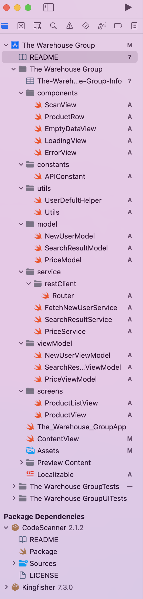

# iOS Developer Test

## SwiftUI-MVVM
A project that uses SwiftUI and swift 5.5, MVVM for software architecture.

## New swift(swift 5.5) features used
- Async/await
- Actors(@MainActor)
- MVVM + Dependency Injection in SwiftUI | Unit Testing

## Compatibility
- Xcode 13.2
- iOS 15 and later
- SwiftUI 3
- Swift 5.5

## Swift Package Dependencies

- CodeScanner
- Kingfisher

## Project overview
 - Search
Provide the ability for customers to search The Warehouse products and view its details. Display the search results in a list. When a product is selected, show the product image, description, price and any applicable specials.
- Scanning
Implement a scan barcode function. Use the phone’s camera to scan an EAN-13 product barcode. If a product is found, show the product image, description, price and any applicable specials.
API
The following APIs should provide the base functionality required for this exercise. Feel free to use additional APIs as documented above to enhance your solution. 

API Name    Documentation     Purpose / Notes
Get newuser    https://twg.portal.azure-api.net/docs/services/57589713a6094c02b844366b/operations/5758a3c3342c17118c531cee
    Creates a new user id for the calling device. This user id is required for all further service
Calls. Store it in the device for further api call. 

Get search    https://twg.portal.azure-api.net/docs/services/57589713a6094c02b844366b/operations/5758a3c3342c17118c531ce8
    Required to get search results based on a
particular search term. This API requires a
BranchID. For this exercise, just use 208 as
the branch ID.

Get price    https://twg.portal.azure-api.net/docs/services/57589713a6094c02b844366b/operations/5758a3c3342c17118c531ce6
    Required to get product information, price and specials based on a particular barcode. 
This API requires a BranchID. For this exercise, just use 208 as the branch ID. 

## Screens 
 

## What you can find in this project
 ### Home screen/ Product List :
- Prouct list serach bar/ Barcode scan.

 ### Second screen :
- Product Image
- Product description
- Product Price

 ### Unit test : covered
- functional testing covered

 ## Unit test Report
 

## Project Folder structure

## License
Copyright tdmihiran@gmail.com,  Licensed under the MIT license.
